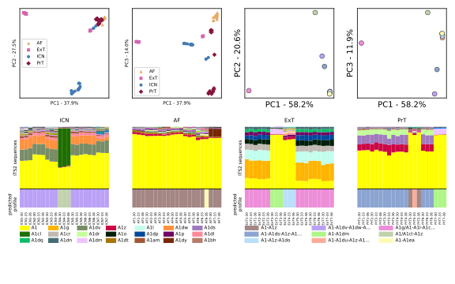
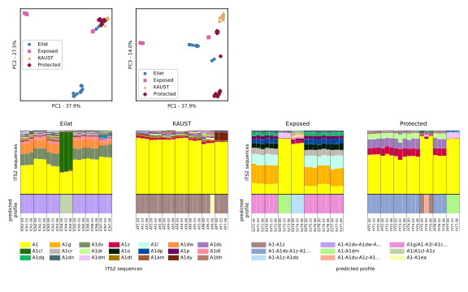

## CBASS_ITS2
This directory contains the python script that was used to plot the ITS2 figures and map for the CBASS84 manuscript.

### Python3 virtual environment setup
The python3 requirements to setup a python3 virtual environment suitable for running the script can be found in [requirements.txt](requirements.txt).

### Data input requirements for the sequence and profile figure
The script uses data as output from the SymPortal analysis in which the CBASS84 sequencing data was run.
Namely, the following inputs files are required and should be placed in the following directory structure:
#### In `CBASS84/CBASS84_ITS2/84/input`:
The relative abundance count tables for the ITS2 sequence abundance and ITS2 type profile abundances.
An excel file containing meta information for the samples.
* 52_DBV_21022019_2019-04-21_09-11-11.379408.profiles.relative.txt
* 52_DBV_21022019_2019-04-21_09-11-11.379408.seqs.relative.txt
* meta_info.xlsx

#### In `CBASS84/CBASS84_ITS2/84/input/between_sample_distances`:
The between-sample distances (Bray-Curtis derived) and calculated PCoA coordinates.
* 2019-05-13_08-54-39.673986.bray_curtis_within_clade_sample_distances.dist
* 2019-05-13_08-54-39.673986.PCoA_coords.csv

#### In `CBASS84/CBASS84_ITS2/84/input/between_profiles/A`:
The between-profile distances (Bray-Curtis derived) and calculated PCoA coordinates.
* 2019-02-21_08-04-43.255493.bray_curtis_within_clade_profile_distances_A.dist
* 2019-02-21_08-04-43.255493.bray_curtis_profiles_PCoA_coords_A.csv

### Data input requirements for the map figure
Whilst much of the data required to plot the map figure is downloaded directly from the [Natural Earth Features](https://www.naturalearthdata.com/features/) resource, some additional GIS data is required for plotting the reef outlines on the map.
#### In `CBASS84/CBASS84_ITS2/84/input/gis`:
The set of 32 .kml files representing reef locations and the .kml file representing the KAUST coastline.

### Script output
The script contains code for creating two figures. 

To create the ITS2 sequence figures the following lines at the bottom of the script should be run: 
```python
sof = SampleOrdinationFigure()
sof.plot_ordination_figure()
```
To create the map figure:
```python
mwif = MapWthInsetFigure()
mwif.draw_map()
```
Each of these functions will produce a set of .svg and .png (dpi=1200) figures.

The output .svgs are as follows:
#### The ITS2 figure
As output from the code:



Final for ms:



#### The map figure
As output from the code:


